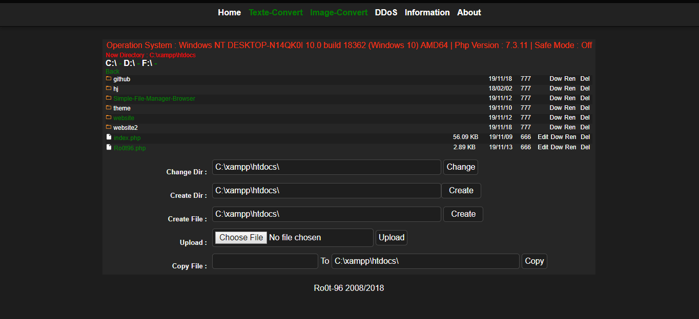
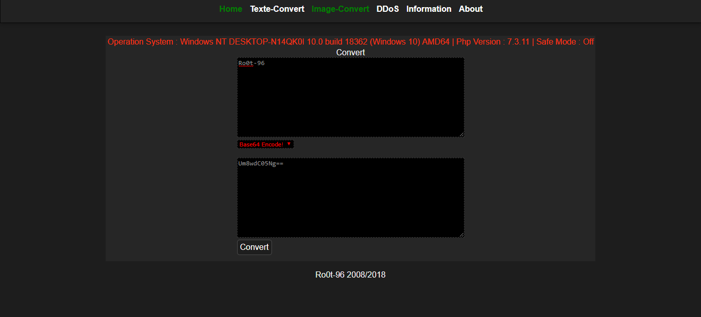
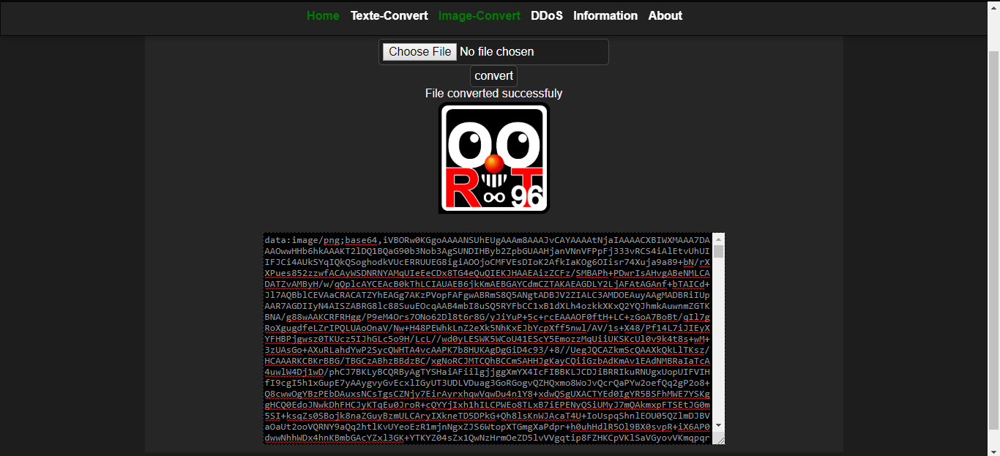
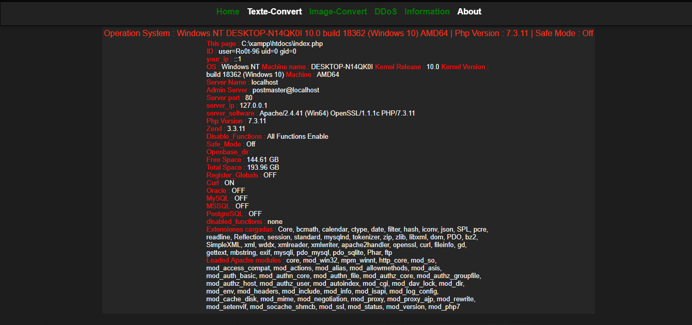
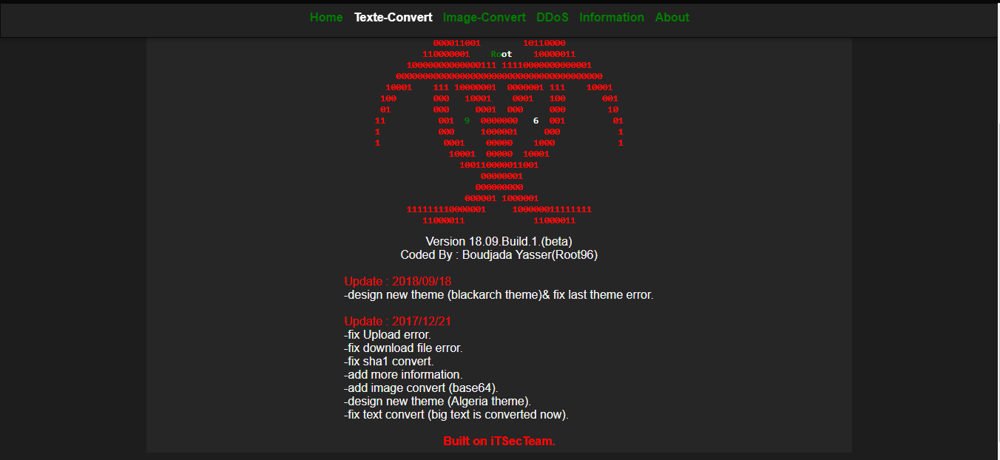

# php_iSHELL







### Languages :
* php
* HTML
* CSS
* JS

# SUPPORTED DISTRIBUTIONS
|Distribution | Version Check | supported | status |
----------|-------|------|-------|
|PHP |7.3 | yes | working   |

# How to get this tool
```
cd
git clone https://github.com/byRo0t96/php_iSHELL.git
cd php_iSHELL
```

## Release History
```
- Version 18.09 [26-09-2018]
...
```


### Contact :

##### Mail : by.root96@gmail.com

© 2020
