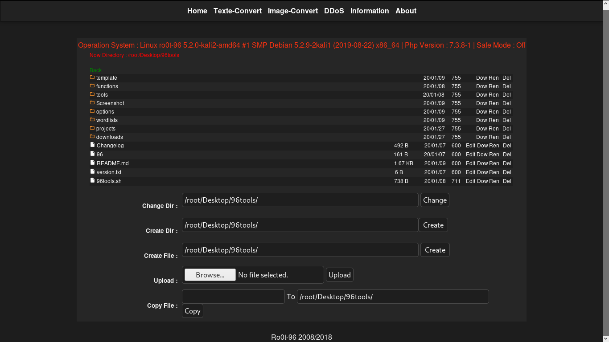

# php_iSHELL
'php_iSHELL' is a php script for control your website files 
fireworksjack_o_lanternferris_wheelshopping_cartperforming_artsgame_dielock♦✂✏packageoutbox_trayinbox_traypaperclipwastebasket.

<div align="center">
    <!--a href="" target="_blank"-->
        
    <!--/a-->
</div>

### Languages :
* php
* HTML
* CSS
* JS

# SUPPORTED DISTRIBUTIONS
|Distribution | Version Check | supported | status |
----------|-------|------|-------|
|PHP |7.3 | yes | working   |

# How to get this tool
```
git clone https://github.com/byRo0t96/php_iSHELL.git
cd php_iSHELL
```

## Release History
```
- Version 18.09 [26-09-2018]
...
```


### Contact :

##### Mail : by.root96@gmail.com

## License
Copyright (C) 2010 - 2020 [byRo0t96](https://byro0t96.github.io/)
